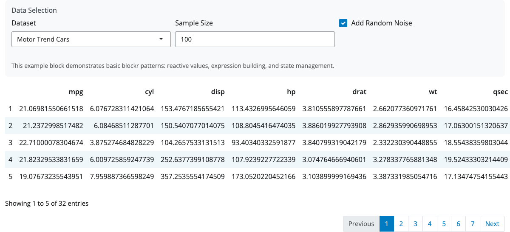

# blockr.example

A minimal blockr package template demonstrating essential patterns for creating blockr packages.

## Installation

```r
# From the monorepo
devtools::load_all("/path/to/blockr/blockr.example")

# Or clone and install
git clone <repo-url>
devtools::install("blockr.example")
```

## Quick Start



```r
library(blockr.core)
library(blockr.example)

# Simple usage
blockr.core::serve(new_example_block())

# With custom parameters
blockr.core::serve(
  new_example_block(
    dataset = "iris",
    n_rows = 75,
    add_noise = TRUE
  )
)
```

## Using as a Template

This package serves as a **template for creating new blockr packages**. It demonstrates all essential blockr patterns in a minimal, easy-to-understand format.

### Template Features

✅ **Simple data block** with 3 parameters (vs 13+ in complex packages)  
✅ **Essential blockr patterns**: reactive values, expression building, state management  
✅ **Clean UI layout** with responsive design  
✅ **Screenshot validation** infrastructure included  
✅ **Built-in datasets** (no external dependencies)  
✅ **Complete documentation** with development guides  

### To Create a New Package from this Template

1. **Copy the structure**:
   ```bash
   cp -r blockr.example my-new-blockr-package
   cd my-new-blockr-package
   ```

2. **Update package identity**:
   - `DESCRIPTION`: Change package name, title, description
   - Rename R files: `example-block.R` → `my-block.R`
   - Update function names: `new_example_block` → `new_my_block`

3. **Customize the block logic**:
   - Replace `generate_sample_data()` with your data source
   - Update constructor parameters for your use case
   - Modify UI inputs for your specific parameters

4. **Test and validate**:
   ```r
   # Generate screenshots to verify functionality
   source("inst/scripts/generate_example_screenshot.R")
   
   # Test the block works
   devtools::load_all()
   blockr.core::serve(new_my_block())
   ```

5. **Update documentation**:
   - Modify README.md with your specific examples
   - Update CLAUDE.md with your package-specific patterns

## Block Documentation

### `new_example_block()`

Creates a simple data block that samples from built-in R datasets.

**Parameters:**
- `dataset`: Dataset to use - "mtcars", "iris", or "faithful" (default: "mtcars")
- `n_rows`: Number of rows to sample (default: 50)
- `add_noise`: Whether to add random noise to numeric columns (default: FALSE)

**Example configurations:**

```r
# Basic usage
basic_block <- new_example_block()

# Sample from iris dataset
iris_block <- new_example_block(dataset = "iris", n_rows = 100)

# Add noise to demonstrate data transformation
noisy_block <- new_example_block(
  dataset = "faithful", 
  n_rows = 200, 
  add_noise = TRUE
)
```

## Development Features

### Screenshot Validation

The package includes proven screenshot validation infrastructure:

```r
# Generate screenshots to verify blocks work
source("inst/scripts/generate_example_screenshot.R")
```

Screenshots demonstrate that blocks are working correctly by showing both:
- ✅ **UI controls** (parameter inputs) 
- ✅ **Data output** (rendered data table)

### Essential blockr Patterns Demonstrated

1. **Reactive Values**: `r_` prefix pattern (`r_dataset`, `r_n_rows`, `r_add_noise`)
2. **Expression Building**: Modern `parse(text = glue::glue())` pattern (not bquote)
3. **State Management**: All constructor parameters included in state list
4. **Clean UI**: Simple grid layout with sections and styling
5. **Internal Helpers**: `generate_sample_data()` shows data processing patterns

### Documentation

- **CLAUDE.md**: Comprehensive development documentation with blockr patterns
- **README.md**: User-facing documentation and template usage instructions
- **Example scripts**: `inst/examples/simple_example.R` for testing

## Why Use This Template?

### Compared to Creating from Scratch
- ✅ All essential patterns already implemented
- ✅ Screenshot validation infrastructure ready
- ✅ Documentation templates included
- ✅ Known working structure

### Compared to Complex Packages
- ✅ Minimal complexity (3 params vs 13+)
- ✅ No external dependencies to debug
- ✅ Clear, understandable code
- ✅ Easy to modify and extend

## Success Validation

A working blockr.example package should:

1. **Generate working screenshots** showing UI + data
2. **Load without errors**: `devtools::load_all()`  
3. **Register blocks properly**: Block appears in blockr registry
4. **Serve successfully**: `blockr.core::serve(new_example_block())`
5. **Show data output**: Screenshots show both controls and data table

The screenshot above confirms all these criteria are met ✅

---

**This package serves as the foundation for creating new blockr packages.** Start here, then customize for your specific use case.